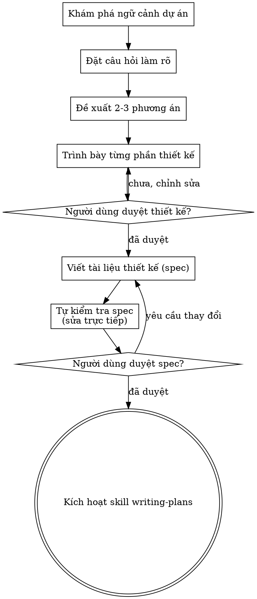

# Phân Tích & Thiết Kế Ý Tưởng (Brainstorming)

Giúp biến các ý tưởng thô thành các thiết kế và đặc tả kỹ thuật (spec) hoàn chỉnh thông qua đối thoại cộng tác tự nhiên.

Bắt đầu bằng việc hiểu rõ ngữ cảnh hiện tại của dự án, sau đó đặt từng câu hỏi một để làm mịn ý tưởng. Khi đã hiểu rõ những gì cần xây dựng, hãy trình bày thiết kế và xin phê duyệt từ người dùng.

<HARD-GATE>
KHÔNG kích hoạt bất kỳ skill thực thi nào, KHÔNG viết bất kỳ dòng code nào, KHÔNG dựng khung dự án (scaffold), và KHÔNG thực hiện bất kỳ hành động triển khai nào cho đến khi bạn đã trình bày thiết kế và người dùng đã phê duyệt thiết kế đó. Điều này áp dụng cho MỌI dự án bất kể độ phức tạp nhận thức được.
</HARD-GATE>

## Chống Ngụy Biện: "Cái Này Quá Đơn Giản Không Cần Thiết Kế"

Mọi dự án đều phải trải qua quy trình này. Từ một danh sách todo, một hàm tiện ích đơn lẻ, đến một thay đổi file config — tất cả. Những dự án "đơn giản" lại chính là nơi các giả định thiếu kiểm chứng gây lãng phí công sức nhiều nhất. Thiết kế có thể ngắn (vài câu cho các dự án cực kỳ đơn giản), nhưng bạn BẮT BUỘC phải trình bày nó và nhận được sự phê duyệt.

## Checklist

Bạn BẮT BUỘC phải tạo một nhiệm vụ (todo) cho mỗi mục dưới đây và hoàn thành theo đúng thứ tự:

1. **Khám phá ngữ cảnh dự án** — kiểm tra file, tài liệu docs, các commit gần đây
2. **Đề xuất visual companion đúng thời điểm (just-in-time)** — KHÔNG đề xuất ngay từ đầu. Lần đầu tiên có một câu hỏi mà việc hiển thị hình ảnh rõ ràng hơn diễn giải bằng lời, hãy đề xuất nó lúc đó (thành tin nhắn riêng); khi người dùng đồng ý, tab trình duyệt sẽ tự mở. Nếu không có câu hỏi hình ảnh nào phát sinh, không bao giờ đề xuất. Xem phần Visual Companion bên dưới.
3. **Đặt các câu hỏi làm rõ** — từng câu hỏi một, hiểu rõ mục đích / hạn chế / tiêu chí thành công
4. **Đề xuất 2-3 phương án tiếp cận** — kèm ưu nhược điểm (trade-offs) và khuyến nghị của bạn
5. **Trình bày thiết kế** — theo từng phần tương ứng với độ phức tạp, xin phê duyệt sau mỗi phần
6. **Viết tài liệu thiết kế (design doc/spec)** — lưu vào `docs/superpowers/specs/YYYY-MM-DD-<chủ-đề>-design.md` và commit
7. **Tự kiểm tra đặc tả (Spec self-review)** — kiểm tra nhanh trực tiếp để phát hiện placeholder, mâu thuẫn, sự mơ hồ, phạm vi (xem bên dưới)
8. **Người dùng duyệt bản spec đã viết** — yêu cầu người dùng duyệt file spec trước khi tiếp tục
9. **Chuyển sang giai đoạn thực thi** — kích hoạt skill writing-plans để tạo kế hoạch triển khai

## Quy Trình Thực Hiện (Process Flow)

**Trạng thái kết thúc của bước này là kích hoạt writing-plans.** KHÔNG kích hoạt frontend-design, mcp-builder, hay bất kỳ skill thực thi nào khác. Skill DUY NHẤT bạn kích hoạt sau khi brainstorming là writing-plans.

## Các Bước Chi Tiết

**Thấu hiểu ý tưởng:**

- Kiểm tra trạng thái dự án hiện tại trước (file, tài liệu docs, commit gần đây)
- Trước khi đặt câu hỏi chi tiết, hãy đánh giá phạm vi: nếu yêu cầu mô tả nhiều subsystem độc lập (ví dụ: "xây dựng nền tảng có chat, lưu trữ file, thanh toán và phân tích"), hãy cờ báo ngay lập tức. Đừng lãng phí câu hỏi tinh chỉnh chi tiết của một dự án cần được chia nhỏ trước.
- Nếu dự án quá lớn cho một spec duy nhất, hãy giúp người dùng chia nhỏ thành các dự án con (sub-project): các phần độc lập là gì, chúng liên hệ ra sao, thứ tự xây dựng thế nào? Sau đó brainstorm dự án con đầu tiên qua quy trình thiết kế chuẩn. Mỗi dự án con sẽ có một chu kỳ spec → plan → thực thi riêng.
- Với các dự án có phạm vi phù hợp, hãy đặt từng câu hỏi một để làm mịn ý tưởng
- Ưu tiên các câu hỏi trắc nghiệm khi có thể, nhưng câu hỏi mở cũng rất tốt
- Chỉ một câu hỏi cho mỗi tin nhắn - nếu một chủ đề cần khám phá thêm, hãy chia thành nhiều câu hỏi
- Tập trung vào sự thấu hiểu: mục đích, hạn chế, tiêu chí thành công

**Khám phá các phương án:**

- Đề xuất 2-3 phương án tiếp cận khác nhau cùng với các ưu nhược điểm (trade-offs)
- Trình bày các lựa chọn dưới dạng đối thoại kèm khuyến nghị và lý do của bạn
- Đưa phương án khuyến nghị lên đầu và giải thích lý do
- Áp dụng nguyên tắc YAGNI (You Aren't Gonna Need It) một cách triệt để — loại bỏ các tính năng không cần thiết khỏi mọi phương án và thiết kế

**Trình bày thiết kế:**

- Khi bạn tin rằng mình đã hiểu rõ những gì cần xây dựng, hãy trình bày thiết kế
- Điều chỉnh độ dài từng phần theo độ phức tạp: vài câu nếu đơn giản, 200-300 từ nếu nhiều góc cạnh kỹ thuật
- Hỏi sau mỗi phần xem thiết kế đến đây đã đúng ý người dùng chưa
- Bao phủ: kiến trúc, các thành phần (components), luồng dữ liệu, xử lý lỗi, testing
- Sẵn sàng quay lại làm rõ nếu có điểm chưa hợp lý

**Thiết kế để cô lập và rõ ràng:**

- Chia hệ thống thành các đơn vị nhỏ hơn, mỗi đơn vị có một mục đích rõ ràng, giao tiếp qua các interface được định nghĩa tốt, có thể hiểu và test độc lập
- Với mỗi đơn vị, bạn phải trả lời được: nó làm gì, dùng nó như thế nào, và nó phụ thuộc vào cái gì?
- Ai đó có thể hiểu một đơn vị làm gì mà không cần đọc mã bên trong không? Bạn có thể thay đổi bên trong mà không làm hỏng nơi sử dụng không? Nếu không, ranh giới cần được thiết kế lại.
- Các đơn vị nhỏ hơn, ranh giới rõ ràng cũng giúp bạn làm việc dễ dàng hơn — bạn tư duy tốt hơn về mã nguồn khi có thể nắm trọn ngữ cảnh cùng lúc, và việc chỉnh sửa tin cậy hơn khi file có trọng tâm. Khi một file phình to, đó thường là tín hiệu cho thấy nó đang làm quá nhiều việc.

**Làm việc trên codebase hiện có:**

- Khám phá cấu trúc hiện tại trước khi đề xuất thay đổi. Tuân theo các pattern sẵn có.
- Nếu code hiện tại có vấn đề ảnh hưởng đến công việc (ví dụ: file quá lớn, ranh giới không rõ ràng, trách nhiệm bị rối), hãy đưa các cải tiến có trọng tâm vào thiết kế — giống cách một lập trình viên giỏi cải thiện code trong khu vực họ đang làm việc.
- Không đề xuất tái cấu trúc (refactoring) không liên quan. Tập trung vào những gì phục vụ mục tiêu hiện tại.

## Sau Khi Thiết Kế

**Tài liệu hóa:**

- Ghi thiết kế đã xác minh (spec) vào `docs/superpowers/specs/YYYY-MM-DD-<chủ-đề>-design.md`
  - (Cấu hình vị trí spec của người dùng sẽ ghi đè mặc định này)
- Sử dụng skill elements-of-style:writing-clearly-and-concisely nếu có
- Commit tài liệu thiết kế vào git

**Tự Kiểm Tra Spec (Spec Self-Review):**
Sau khi viết tài liệu spec, hãy nhìn lại nó bằng góc nhìn mới:

1. **Rà soát Placeholder:** Có phần nào ghi "TBD", "TODO", chưa hoàn thành hoặc yêu cầu mơ hồ không? Hãy sửa ngay.
2. **Tính nhất quán nội bộ:** Các phần có mâu thuẫn với nhau không? Kiến trúc có khớp với mô tả tính năng không?
3. **Kiểm tra phạm vi:** Nội dung này có đủ tập trung cho một kế hoạch triển khai duy nhất không, hay cần chia nhỏ?
4. **Kiểm tra sự mơ hồ:** Có yêu cầu nào có thể hiểu theo 2 cách khác nhau không? Nếu có, chọn 1 cách và làm cho nó rõ ràng.

Sửa trực tiếp các vấn đề trong file. Không cần review lại từ đầu — chỉ cần sửa và tiếp tục.

**Cổng Phê Duyệt Của Người Dùng (User Review Gate):**
Sau khi vòng kiểm tra spec hoàn tất, hãy yêu cầu người dùng xem xét bản spec trước khi tiến hành:

> "Thiết kế đã được ghi và commit tại `<path>`. Xin vui lòng xem qua và cho tôi biết nếu bạn muốn thay đổi điều gì trước khi chúng ta bắt đầu viết kế hoạch triển khai."

Chờ phản hồi của người dùng. Nếu họ yêu cầu thay đổi, hãy sửa và chạy lại vòng tự kiểm tra spec. Chỉ tiến hành khi người dùng đã duyệt.

**Triển khai:**

- Kích hoạt skill writing-plans để tạo kế hoạch triển khai chi tiết
- KHÔNG kích hoạt bất kỳ skill nào khác. writing-plans là bước tiếp theo.

## Visual Companion

Một công cụ hỗ trợ trên trình duyệt giúp hiển thị mockup, sơ đồ và các tùy chọn hình ảnh trong quá trình brainstorming. Được cung cấp dưới dạng một tool — không phải một chế độ (mode). Việc người dùng chấp nhận visual companion có nghĩa là nó sẵn sàng cho các câu hỏi cần minh họa hình ảnh; KHÔNG có nghĩa là mọi câu hỏi đều phải đẩy lên trình duyệt.

**Đề xuất companion (đúng thời điểm - just-in-time):** KHÔNG đề xuất ngay từ đầu. Hãy chờ cho đến khi có một câu hỏi mà việc hiển thị hình ảnh thực sự rõ ràng hơn diễn giải — một câu hỏi về mockup / layout / sơ đồ thực sự, chứ không chỉ là một *chủ đề* UI. Lần đầu tiên điều đó xảy ra, hãy đề xuất nó như một tin nhắn riêng biệt:
> "Phần tiếp theo này có thể dễ hình dung hơn nếu tôi minh họa — tôi có thể dựng mockup, sơ đồ và so sánh trên một tab trình duyệt khi chúng ta trao đổi. Tính năng này khá mới và có thể tốn token. Bạn có muốn thử không? Tôi sẽ mở nó cho bạn."

**Lời đề xuất này BẮT BUỘC phải là tin nhắn riêng.** Chỉ có lời đề xuất — không kèm câu hỏi làm rõ, tóm tắt hay nội dung nào khác. Chờ phản hồi từ người dùng. Nếu họ đồng ý, hãy khởi chạy server với cờ `--open` để trình duyệt tự động mở màn hình đầu tiên. Nếu họ từ chối, tiếp tục bằng văn bản thuần túy và không đề xuất lại trừ khi người dùng chủ động nhắc đến.

**Quyết định theo từng câu hỏi:** Ngay cả khi người dùng đã chấp nhận, hãy quyết định CHO MỖI CÂU HỎI xem nên dùng trình duyệt hay terminal. Bài kiểm tra: **người dùng có hiểu tốt hơn bằng cách NHÌN thay vì ĐỌC không?**

- **Dùng trình duyệt** cho nội dung MANG TÍNH HÌNH ẢNH — mockup, wireframe, so sánh bố cục, sơ đồ kiến trúc, thiết kế visual đặt cạnh nhau
- **Dùng terminal** cho nội dung dạng VĂN BẢN — câu hỏi yêu cầu, lựa chọn khái niệm, danh sách ưu nhược điểm, tùy chọn trắc nghiệm A/B/C/D bằng văn bản, quyết định phạm vi

Một câu hỏi về chủ đề UI không tự động là một câu hỏi hình ảnh. "Phong cách giao diện bạn muốn là gì?" là câu hỏi khái niệm — dùng terminal. "Bố cục wizard nào trong 2 mẫu này hợp lý hơn?" là câu hỏi hình ảnh — dùng trình duyệt.

Nếu người dùng đồng ý dùng companion, hãy đọc hướng dẫn chi tiết trước khi tiếp tục:
`skills/brainstorming/visual-companion.md`
