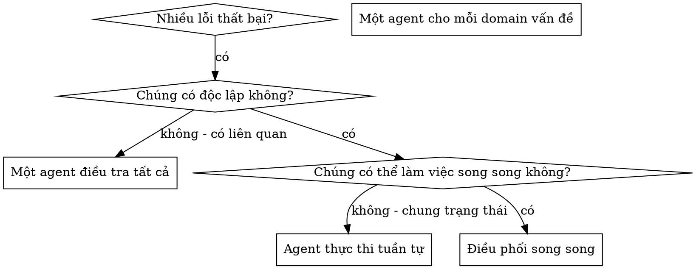

# Điều Phối Agent Song Song (Dispatching Parallel Agents)

## Tổng Quan

Bạn ủy quyền các nhiệm vụ cho những agent chuyên biệt với ngữ cảnh được cô lập. Bằng cách thiết kế chính xác hướng dẫn và ngữ cảnh của họ, bạn đảm bảo họ luôn tập trung và thành công trong nhiệm vụ. Họ không bao giờ nên thừa hưởng ngữ cảnh hoặc lịch sử session của bạn — bạn tạo ra chính xác những gì họ cần. Điều này cũng giúp bảo tồn ngữ cảnh của chính bạn cho công việc điều phối.

Khi bạn gặp nhiều thất bại không liên quan (file test khác nhau, subsystem khác nhau, bug khác nhau), việc điều tra từng cái một sẽ gây lãng phí thời gian. Mỗi cuộc điều tra là độc lập và có thể diễn ra song song.

**Nguyên tắc cốt lõi:** Điều phối một agent cho mỗi vùng vấn đề (problem domain) độc lập. Để họ làm việc đồng thời.

## Khi Nào Sử Dụng



**Sử dụng khi:**
- 3+ file test bị lỗi với các nguyên nhân gốc rễ khác nhau
- Nhiều subsystem bị hỏng một cách độc lập
- Mỗi vấn đề có thể hiểu được mà không cần ngữ cảnh từ những cái khác
- Không có trạng thái dùng chung (shared state) giữa các đợt điều tra

**Không sử dụng khi:**
- Các lỗi có liên quan tới nhau (sửa lỗi này có thể tự động sửa lỗi kia)
- Cần hiểu toàn bộ trạng thái hệ thống
- Các agent sẽ can thiệp/làm gián đoạn lẫn nhau

## Mẫu Thực Hiện (The Pattern)

### 1. Xác Định Các Domain Độc Lập

Góm nhóm các lỗi thất bại theo những gì bị hỏng:
- Các test file A: Luồng phê duyệt tool
- Các test file B: Hành vi hoàn thành đợt (batch completion)
- Các test file C: Chức năng hủy (abort)

Mỗi domain là độc lập - việc sửa luồng phê duyệt tool không ảnh hưởng đến test chức năng hủy.

### 2. Tạo Nhiệm Vụ Trọng Tâm Cho Agent

Mỗi agent nhận được:
- **Phạm vi cụ thể:** Một file test hoặc subsystem
- **Mục tiêu rõ ràng:** Làm cho các test này vượt qua
- **Ràng buộc:** Không thay đổi mã nguồn khác
- **Kết quả mong đợi:** Tóm tắt những gì tìm thấy và đã sửa

### 3. Điều Phối Song Song

Gửi tất cả các yêu cầu điều phối subagent trong cùng một phản hồi — chúng sẽ chạy song song:

```text
Subagent (general-purpose): "Sửa các lỗi thất bại trong src/agents/agent-tool-abort.test.ts"
Subagent (general-purpose): "Sửa các lỗi thất bại trong src/agents/batch-completion-behavior.test.ts"
Subagent (general-purpose): "Sửa các lỗi thất bại trong src/agents/tool-approval-race-conditions.test.ts"
# Cả 3 agent chạy đồng thời.
```

Nhiều lệnh điều phối trong một phản hồi = thực thi song song. Mỗi phản hồi một lệnh = thực thi tuần tự.

### 4. Review Và Tích Hợp

Khi các agent hoàn thành trả về:
- Đọc từng bản tóm tắt
- Xác minh các bản sửa lỗi không xung đột lẫn nhau
- Chạy toàn bộ bộ test suite
- Tích hợp tất cả các thay đổi

## Cấu Trúc Prompt Cho Agent

Một prompt tốt cho agent cần:
1. **Tập trung** - Một domain vấn đề rõ ràng
2. **Tự đóng gói** - Đầy đủ ngữ cảnh cần thiết để hiểu vấn đề
3. **Cụ thể về output** - Agent nên trả về kết quả gì?

```markdown
Sửa 3 test bị thất bại trong src/agents/agent-tool-abort.test.ts:

1. "should abort tool with partial output capture" - kỳ vọng 'interrupted at' trong message
2. "should handle mixed completed and aborted tools" - tool nhanh bị hủy thay vì hoàn thành
3. "should properly track pendingToolCount" - kỳ vọng 3 kết quả nhưng nhận 0

Đây là các vấn đề liên quan đến timing/race condition. Nhiệm vụ của bạn:

1. Đọc file test và hiểu từng test xác minh điều gì
2. Xác định nguyên nhân gốc rễ - do timing hay bug thực tế?
3. Sửa bằng cách:
   - Thay thế các timeout cố định bằng cơ chế chờ dựa trên sự kiện (event-based waiting)
   - Sửa bug trong phần triển khai hủy nếu phát hiện
   - Điều chỉnh kỳ vọng test nếu hành vi bị thay đổi
   

ĐỪNG chỉ tăng timeout — hãy tìm nguyên nhân thực sự.

Trả về: Tóm tắt những gì bạn tìm thấy và những gì bạn đã sửa.
```

## Các Lỗi Phổ Biến

**❌ Quá rộng:** "Sửa tất cả các test đi" - agent bị mất phương hướng
**✅ Cụ thể:** "Sửa agent-tool-abort.test.ts" - phạm vi tập trung

**❌ Không có ngữ cảnh:** "Sửa lỗi race condition đi" - agent không biết ở đâu
**✅ Ngữ cảnh:** Dán các thông báo lỗi và tên bài test vào

**❌ Không có ràng buộc:** Agent có thể tái cấu trúc lại toàn bộ hệ thống
**✅ Ràng buộc:** "KHÔNG thay đổi mã production" hoặc "Chỉ sửa file test"

**❌ Output mơ hồ:** "Sửa nó đi" - bạn không biết những gì đã thay đổi
**✅ Cụ thể:** "Trả về tóm tắt nguyên nhân gốc rễ và các thay đổi"

## Khi NÀO KHÔNG Nên Sử Dụng

**Các lỗi có liên quan:** Sửa một cái có thể sửa các cái khác - hãy điều tra cùng nhau trước
**Cần ngữ cảnh toàn bộ:** Việc thấu hiểu đòi hỏi phải nhìn thấy toàn bộ hệ thống
**Gỡ lỗi khám phá:** Bạn chưa biết chính xác cái gì bị hỏng
**Dùng chung trạng thái (Shared state):** Các agent sẽ xung đột (chỉnh sửa cùng file, dùng chung tài nguyên)
