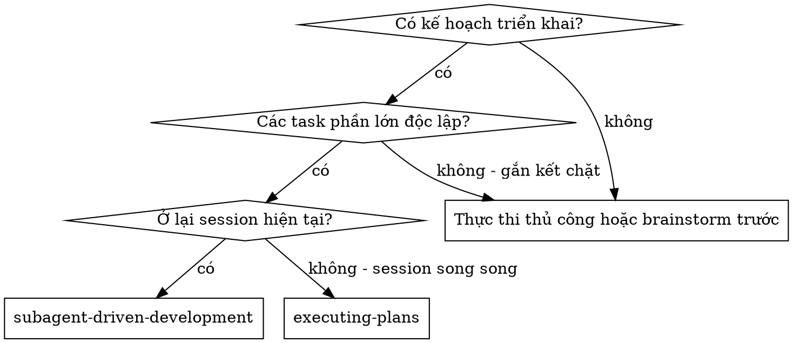

# Phát Triển Điểu Phối Qua Subagent (Subagent-Driven Development)

Thực thi kế hoạch bằng cách điều phối một subagent implementer tươi mới cho mỗi task, tiến hành review task (tuân thủ spec + chất lượng code) sau mỗi task, và review tổng thể toàn bộ nhánh ở bước cuối cùng.

**Tại sao dùng subagent:** Bạn ủy quyền nhiệm vụ cho các agent chuyên biệt với ngữ cảnh được cô lập. Bằng cách thiết kế chính xác hướng dẫn và ngữ cảnh cho họ, bạn đảm bảo họ luôn tập trung và thành công. Họ không bao giờ kế thừa lịch sử hay ngữ cảnh session của bạn — bạn tạo ra đúng những gì họ cần. Điều này cũng giúp bảo tồn ngữ cảnh của chính bạn cho công việc điều phối.

**Nguyên tắc cốt lõi:** Subagent tươi mới cho mỗi task + review task (spec + chất lượng) + review tổng thể cuối cùng = chất lượng cao, tái lặp nhanh

**Thuyết minh (Narration):** giữa các lời gọi công cụ, chỉ thuyết minh tối đa một dòng ngắn — nhật ký (ledger) và kết quả công cụ sẽ lưu trữ ghi chép.

**Thực thi liên tục:** Đừng dừng lại để hỏi ý kiến đối tác con người giữa các nhiệm vụ. Hãy thực thi tất cả nhiệm vụ trong kế hoạch mà không dừng lại. Các lý do duy nhất để dừng lại là: Trạng thái BLOCKED không thể tự giải quyết, sự mơ hồ thực sự ngăn cản tiến độ, hoặc tất cả các task đã hoàn thành. Những tin nhắn như "Tôi có nên tiếp tục không?" hay tóm tắt tiến độ chỉ làm lãng phí thời gian của họ — họ đã bảo bạn thực thi kế hoạch, nên hãy thực thi nó.

## Khi Nào Sử Dụng

**So với Executing Plans (session song song):**
- Cùng một session (không chuyển đổi ngữ cảnh)
- Subagent tươi mới cho từng task (không làm bẩn ngữ cảnh)
- Review sau từng task (tuân thủ spec + chất lượng code), review tổng thể ở cuối
- Tái lặp nhanh hơn (không có con người can thiệp giữa các task)

## Quy Trình Chi Tiết

### Thiết Lập (Setup)

Đảm bảo công việc diễn ra trong một không gian làm việc cô lập: sử dụng `superpowers:using-git-worktrees` để tạo mới hoặc xác minh cái sẵn có. Không bao giờ bắt đầu triển khai trên nhánh main/master nếu không có sự đồng ý rõ ràng của người dùng.

Bộ nhớ hội thoại không tồn tại sau đợt nén (compaction). Hãy theo dõi tiến độ trong một file nhật ký (`progress.md`), chứ không chỉ dựa vào todos.

- Mỗi kế hoạch sở hữu một workspace: khi bắt đầu skill, chạy `scripts/sdd-workspace PLAN_FILE` — lệnh này in ra thư mục git-ignored (`<repo-root>/.superpowers/sdd/<plan-basename>/`).
- Kiểm tra nhật ký tại `<workspace>/progress.md`. Nếu dòng đầu tiên trùng tên file plan, các task có dòng `Task <N>: complete` là ĐÃ XONG — không điều phối lại; tiếp tục ở task đầu tiên chưa hoàn thành.
- Tạo nhật ký với dòng danh tính đầu tiên: `# SDD ledger — plan: <plan file path>`.

Đọc kế hoạch một lần, ghi nhận ngữ cảnh và Hạn Chế Toàn Cục (Global Constraints), tạo todo cho từng task.

### Lựa Chọn Model (Model Selection)

Sử dụng model ít tốn chi phí nhất mà vẫn đảm bảo xử lý tốt từng vai trò để tiết kiệm chi phí và tăng tốc độ.

- **Nhiệm vụ triển khai cơ học** (hàm cô lập, spec rõ ràng, 1-2 file): dùng model nhanh, rẻ.
- **Nhiệm vụ tích hợp và phán đoán** (phối hợp nhiều file, khớp pattern, gỡ lỗi): dùng model tiêu chuẩn.
- **Nhiệm vụ kiến trúc và thiết kế**: dùng model mạnh nhất có sẵn. Đợt review tổng thể toàn bộ nhánh ở cuối cũng là một trong số này.
- **Vòng lặp sửa lỗi leo thang (vòng 4-5)**: dùng model cao hơn ít nhất một cấp so với implementer bị kẹt.

### Vòng Lặp Nhiệm Vụ (Task Loop)

1. **Điều phối Implementer:**
   - Ghi lại BASE (`git rev-parse HEAD`) trước khi điều phối.
   - Chạy `scripts/task-brief PLAN_FILE N` để trích xuất nội dung task ra file brief.
   - Truyền file brief, vị trí file report (`task-N-report.md`), và các interface cần thiết cho subagent implementer.
   
2. **Xử lý Báo cáo (Report):**
   - **DONE:** Tạo gói review (`scripts/review-package PLAN_FILE BASE HEAD`), điều phối task reviewer.
   - **DONE_WITH_CONCERNS:** Đọc các mối lo ngại trước khi tiếp tục.
   - **NEEDS_CONTEXT:** Cung cấp thông tin thiếu và điều phối lại.
   - **BLOCKED:** Đánh giá điểm tắc nghẽn, nâng cấp model hoặc chia nhỏ task nếu cần.

3. **Review Nhiệm vụ:**
   - Chạy `scripts/review-package PLAN_FILE BASE HEAD` và truyền file diff cho reviewer.
   - Kiểm tra cả 2 tiêu chí: Tuân thủ Spec (Spec Compliance) VÀ Chất lượng Code (Code Quality).

4. **Vòng lặp sửa lỗi (Fix Loop):**
   - Tối đa 5 vòng cho mỗi task.
   - Vòng 1-3: Mở lại implementer ban đầu.
   - Vòng 4-5: Điều phối implementer mới trên model mạnh hơn.
   - Đạt ngắt mạch (Round 5 breaker): Phán quyết các phát hiện mở hoặc báo BLOCKED.

5. **Hoàn thành Nhiệm vụ:**
   - Khi review báo sạch (clean), ghi `Task <N>: complete` vào nhật ký, đánh dấu todo xong và chuyển sang task tiếp theo.

## Review Tổng Thể Cuối Cùng (Final Review)

Chạy `scripts/review-package PLAN_FILE MERGE_BASE HEAD` và điều phối code-reviewer trên model mạnh nhất để kiểm tra toàn bộ nhánh trước khi kết thúc.

## Hoàn Tất (Finish)

Xóa workspace tạm của kế hoạch (`rm -rf <workspace>`) và sử dụng skill `superpowers:finishing-a-development-branch`.
