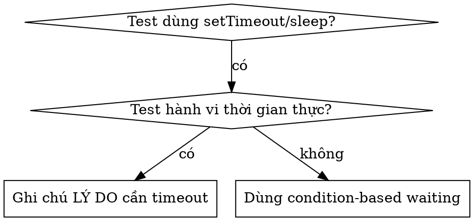

# Chờ Đợi Dựa Trên Điều Kiện (Condition-Based Waiting)

## Tổng Quan

Các bài test chập chờn (flaky tests) thường đoán khoảng thời gian với các khoản hoãn cố định (arbitrary delays). Điều này tạo ra các lỗi race condition khi test vượt qua trên máy nhanh nhưng thất bại dưới tải nặng hoặc trong môi trường CI/CD.

**Nguyên tắc cốt lõi:** Chờ đợi điều kiện thực sự mà bạn quan tâm, chứ không đoán thời gian cần thiết là bao lâu.

## Khi Nào Sử Dụng



**Sử dụng khi:**
- Các test có khoản hoãn cố định (`setTimeout`, `sleep`, `time.sleep()`)
- Các test bị chập chờn (lúc pass lúc fail)
- Test bị timeout khi chạy song song
- Chờ các thao tác bất đồng bộ (async) hoàn thành

## Pattern Cốt Lõi

```typescript
// ❌ TRƯỚC ĐÂY: Đoán thời gian
await new Promise(r => setTimeout(r, 50));
const result = getResult();
expect(result).toBeDefined();

// ✅ SAU ĐÓ: Chờ cho tới khi đạt điều kiện
await waitFor(() => getResult() !== undefined);
const result = getResult();
expect(result).toBeDefined();
```

## Các Pattern Nhanh

| Kịch bản | Pattern |
|----------|---------|
| Chờ sự kiện (event) | `waitFor(() => events.find(e => e.type === 'DONE'))` |
| Chờ trạng thái (state) | `waitFor(() => machine.state === 'ready')` |
| Chờ số lượng (count) | `waitFor(() => items.length >= 5)` |
| Chờ file | `waitFor(() => fs.existsSync(path))` |
| Điều kiện phức tạp | `waitFor(() => obj.ready && obj.value > 10)` |
