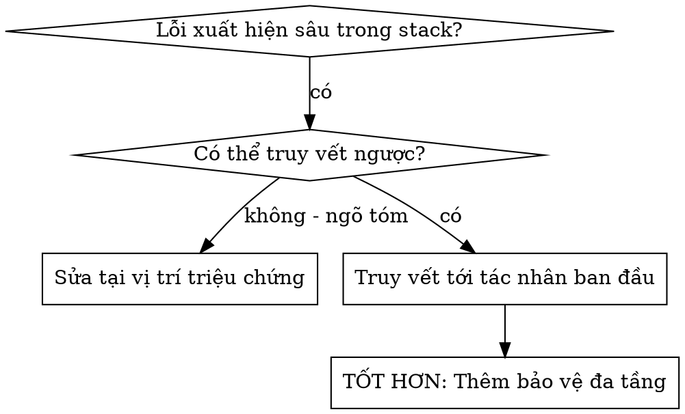

# Truy Vết Nguyên Nhân Gốc Rễ (Root Cause Tracing)

## Tổng Quan

Bọ (Bug) thường xuất hiện ở những nơi rất sâu trong stack (lệnh `git init` chạy sai thư mục, file tạo sai vị trí, cơ sở dữ liệu mở sai đường dẫn). Bản năng của bạn là muốn sửa ngay tại nơi lỗi xuất hiện, nhưng đó chỉ là sửa triệu chứng.

**Nguyên tắc cốt lõi:** Truy vết ngược qua chuỗi gọi hàm (call chain) cho đến khi bạn tìm thấy tác nhân kích hoạt ban đầu (original trigger), sau đó sửa tận gốc.

## Khi Nào Sử Dụng

**Sử dụng khi:**
- Lỗi xảy ra ở sâu trong quá trình thực thi (không phải tại điểm vào API)
- Stack trace hiển thị chuỗi gọi hàm dài
- Chưa rõ dữ liệu không hợp lệ bắt nguồn từ đâu
- Cần tìm bài test/đoạn code nào kích hoạt sự cố

## Quy Trình Truy Vết

1. **Quan Sát Triệu Chứng** (ví dụ: `git init` thất bại tại thư mục nguồn)
2. **Tìm Nguyên Nhân Trực Tiếp** (Đoạn code nào trực tiếp chạy lệnh này?)
3. **Hỏi: Cái Gì Đã Gọi Hàm Này?** (Vết ngược theo chuỗi caller)
4. **Tiếp Tục Truy Vết Ngược Lên** (Giá trị nào đã được truyền vào?)
5. **Tìm Tác Nhân Kích Hoạt Ban Đầu** (Sửa lỗi tại chính nơi giá trị sai được tạo ra)
