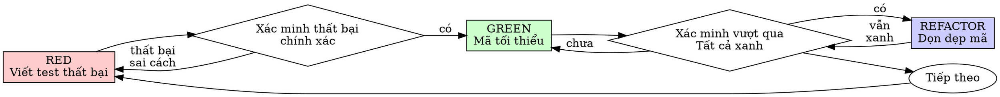

# Phát Triển Hướng Kiểm Thử (Test-Driven Development - TDD)

## Tổng Quan

Viết bài test trước. Quan sát nó thất bại. Viết mã tối thiểu để vượt qua test.

**Nguyên tắc cốt lõi:** Nếu bạn không tận mắt chứng kiến bài test thất bại, bạn không thể biết liệu nó có đang kiểm tra đúng thứ cần kiểm tra hay không.

**Vi phạm từng chữ của quy tắc là vi phạm tinh thần của quy tắc.**

## Khi Nào Sử Dụng

**Luôn luôn:**
- Tính năng mới
- Sửa lỗi (bug fix)
- Tái cấu trúc (refactoring)
- Thay đổi hành vi hệ thống

**Ngoại lệ (phải hỏi ý kiến đối tác con người của bạn):**
- Bản dựng thử nghiệm bỏ đi (throwaway prototypes)
- Mã nguồn tự động sinh (generated code)
- Các file cấu hình

Nghĩ đến việc "bỏ qua TDD chỉ một lần này thôi"? Dừng lại ngay. Đó là sự ngụy biện.

## Luật Thép (The Iron Law)

```
KHÔNG CÓ MÃ PRODUCTION NÀO ĐƯỢC VIẾT KHI CHƯA CÓ BÀI TEST THẤT BẠI TRƯỚC ĐÓ
```

Viết code trước khi viết test? Xóa nó đi. Bắt đầu lại từ đầu.

**Không có ngoại lệ:**
- Đừng giữ lại làm "tham khảo"
- Đừng "điều chỉnh" nó trong khi viết test
- Đừng nhìn vào nó
- Xóa có nghĩa là xóa sạch

Triển khai lại mới hoàn toàn từ các bài test. Chấm hết.

## Chu Kỳ Red-Green-Refactor



### RED - Viết Test Thất Bại

Viết một bài test tối thiểu thể hiện điều gì sẽ xảy ra.

<Good>
```typescript
test('thử lại tác vụ thất bại 3 lần', async () => {
  let attempts = 0;
  const operation = () => {
    attempts++;
    if (attempts < 3) throw new Error('fail');
    return 'success';
  };

  const result = await retryOperation(operation);

  expect(result).toBe('success');
  expect(attempts).toBe(3);
});
```
Tên rõ ràng, test hành vi thực tế, một mục đích duy nhất
</Good>

<Bad>
```typescript
test('retry hoạt động', async () => {
  const mock = jest.fn()
    .mockRejectedValueOnce(new Error())
    .mockRejectedValueOnce(new Error())
    .mockResolvedValueOnce('success');
  await retryOperation(mock);
  expect(mock).toHaveBeenCalledTimes(3);
});
```
Tên mơ hồ, test hàm mock chứ không test code thực tế
</Bad>

**Yêu cầu:**
- Một hành vi duy nhất
- Tên rõ ràng
- Code thực tế (không dùng mock trừ khi không thể tránh khỏi)

### Xác Minh RED - Quan Sát Nó Thất Bại

**BẮT BUỘC. Không bao giờ bỏ qua.**

```bash
npm test path/to/test.test.ts
```

Xác nhận:
- Test thất bại (thất bại logic, không phải lỗi cú pháp/import)
- Thông báo thất bại đúng như kỳ vọng
- Thất bại vì chưa có tính năng (không phải do gõ sai chính tả)

**Test vượt qua (Pass)?** Bạn đang test hành vi đã tồn tại. Hãy sửa lại test.

**Test bị lỗi hệ thống (Error)?** Sửa lỗi hệ thống, chạy lại cho đến khi nó thất bại một cách chính xác.

### GREEN - Mã Triển Khai Tối Thiểu

Viết đoạn code đơn giản nhất có thể để làm cho test vượt qua.

<Good>
```typescript
async function retryOperation<T>(fn: () => Promise<T>): Promise<T> {
  for (let i = 0; i < 3; i++) {
    try {
      return await fn();
    } catch (e) {
      if (i === 2) throw e;
    }
  }
  throw new Error('unreachable');
}
```
Vừa đủ để test vượt qua
</Good>

<Bad>
```typescript
async function retryOperation<T>(
  fn: () => Promise<T>,
  options?: {
    maxRetries?: number;
    backoff?: 'linear' | 'exponential';
    onRetry?: (attempt: number) => void;
  }
): Promise<T> {
  // YAGNI - Bạn chưa cần tới những thứ này
}
```
Thiết kế quá đà (Over-engineered)
</Bad>

Không thêm tính năng mới, không tái cấu trúc code khác, không "cải tiến" vượt quá phạm vi bài test.

### Xác Minh GREEN - Quan Sát Nó Vượt Qua

**BẮT BUỘC.**

```bash
npm test path/to/test.test.ts
```

Xác nhận:
- Bài test vượt qua (Pass)
- Các bài test khác vẫn vượt qua
- Output sạch sẽ (không có lỗi hay cảnh báo thừa)

**Test thất bại?** Sửa code triển khai, không sửa test.

**Các test khác thất bại?** Sửa ngay lập tức.

### REFACTOR - Dọn Dẹp Mã

Chỉ làm sau khi đã Xanh (Green):
- Loại bỏ sự trùng lặp (duplication)
- Cải thiện tên biến/hàm
- Trích xuất các hàm hỗ trợ (helpers)

Luôn giữ các bài test xanh. Không thêm hành vi mới trong bước này.

### Lặp Lại

Chuyển sang bài test thất bại tiếp theo cho tính năng tiếp theo.

## Bài Test Tốt

| Tiêu chuẩn | Tốt | Tồi |
|---------|------|-----|
| **Tối thiểu** | Một mục đích. Tên có chữ "và"? Hãy chia đôi. | `test('xác minh email và domain và khoảng trắng')` |
| **Rõ ràng** | Tên mô tả chính xác hành vi | `test('test1')` |
| **Thể hiện ý định** | Thể hiện API mong muốn | Làm mờ đục những gì code nên làm |

Khi viết hoặc thay đổi bất kỳ bài test nào, hãy đọc [writing-good-tests.md](writing-good-tests.md) để biết các quy tắc giữ cho bài test trung thực.

## Ngụy Biện Phổ Biến (Common Rationalizations)

| Lời bào chữa | Thực tế |
|--------|---------|
| "Quá đơn giản không cần test" | Code đơn giản vẫn bị hỏng. Viết test chỉ mất 30 giây. |
| "Tôi sẽ viết test sau" | Các bài test viết sau thường đỗ ngay lập tức — điều này chẳng chứng minh được gì. Chúng có thể test sai thứ, test phần triển khai thay vì hành vi, hoặc bỏ sót các trường hợp biên bạn đã quên. Việc không tận mắt thấy nó thất bại có nghĩa bạn chưa chứng minh được nó có thể bắt được bug. |
| "Viết test sau cũng đạt cùng mục tiêu (tinh thần thay vì nghi thức)" | Test viết sau trả lời "code này làm gì?"; test viết trước trả lời "code này NÊN làm gì?" Test viết sau bị định kiến bởi code bạn đã viết. |
| "Tôi đã test thủ công rồi" | Test thủ công mang tính đối phó: không có ghi chép, không thể chạy lại tự động khi code đổi. "Chạy tốt khi tôi thử" ≠ toàn diện. Test tự động chạy lại giống hệt nhau mọi lúc. |
| "Xóa công sức X giờ thật lãng phí" | Ngụy biện chi phí chìm — thời gian đó đằng nào cũng đã mất. Lựa chọn thực sự: viết lại với TDD (độ tin cậy cao) vs giữ lại và vá test vào sau (độ tin cậy thấp, dễ ẩn bug). Giữ lại code không thể tin tưởng mới là sự lãng phí. |
